:toc: left
:toclevels: 2
:toc-title: Sumário
:!figure-caption:

= Processamento Digital de Imagens
Igor Cirne Borges de Oliveira

:icons: font
:summary:

toc::[]

== Introdução

Esta página reúne os projetos e atividades desenvolvidos na disciplina de Processamento Digital de Imagens (PDI), organizados em formato AsciiDoc e hospedados no GitHub Pages.

== Lista 1

=== Capítulo 2. Manipulação de pixels em imagens

Com base no programa https://github.com/IgorCirne/IgorCirnePDI/tree/main/exercicio_2/pixels.cpp[pixels.cpp], foi desenvolvido o código https://github.com/IgorCirne/IgorCirnePDI/tree/main/exercicio_2/regions.cpp[regions.cpp], que recebe como entrada dois pontos P1 e P2 (coordenadas x e y) e aplica o efeito de negativo à região compreendida entre eles.

Imagem de entrada:

.Figura 1: biel.png
[link=https://github.com/IgorCirne/IgorCirnePDI/tree/main/exercicio_2/biel.png]

Após compilar o código com o arquivo https://github.com/IgorCirne/IgorCirnePDI/tree/main/exercicio_2/CMakeLists.txt[CMakeLists.txt], os seguintes resultados foram obtidos:

*P1 = [100, 50], P2 = [200, 200]*

.Figura 2: biel-2.png
[link=https://github.com/IgorCirne/IgorCirnePDI/tree/main/exercicio_2/biel-2.png]
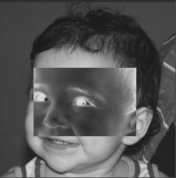

*P1 = [50, 50], P2 = [100, 150]*

.Figura 3: biel-3.png
[link=https://github.com/IgorCirne/IgorCirnePDI/tree/main/exercicio_2/biel-3.png]
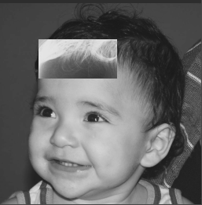

Na segunda parte do exercício, que envolvia a troca de regiões, foi criado o programa https://github.com/IgorCirne/IgorCirnePDI/tree/main/exercicio_2/trocaregioes.cpp[trocaregioes.cpp], utilizando um novo arquivo de build: https://github.com/IgorCirne/IgorCirnePDI/tree/main/exercicio_2/CMakeLists2.txt[CMakeLists.txt].

Resultado:

.Figura 4: trocaregioes.png
[link=https://github.com/IgorCirne/IgorCirnePDI/tree/main/exercicio_2/trocaregioes.png]
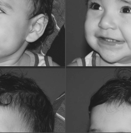

=== Capítulo 5. Serialização de dados com FileStorage

Nesta atividade, foi solicitado gerar uma imagem senoidal de 256x256 pixels com 4 períodos e amplitude 127, salvando-a em formato `.png` e `.yml`.

Exemplo de senóide com 8 períodos:

.Figura 5
[link=https://github.com/IgorCirne/IgorCirnePDI/tree/main/exercicio_5/8-senoide-256.png]
image::exercicio_5/8-senoide-256.png[]

Arquivo YML: https://github.com/IgorCirne/IgorCirnePDI/tree/main/exercicio_5/8-senoide-256.yml

Resultado com 4 períodos:

.Figura 6
[link=https://github.com/IgorCirne/IgorCirnePDI/tree/main/exercicio_5/4-senoide-256.png]
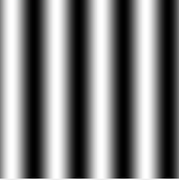

Arquivo YML: https://github.com/IgorCirne/IgorCirnePDI/tree/main/exercicio_5/4-senoide-256.yml

Em seguida, foi traçado um gráfico da diferença entre uma linha extraída dessas imagens:

.Figura 7: Diferença entre senóides
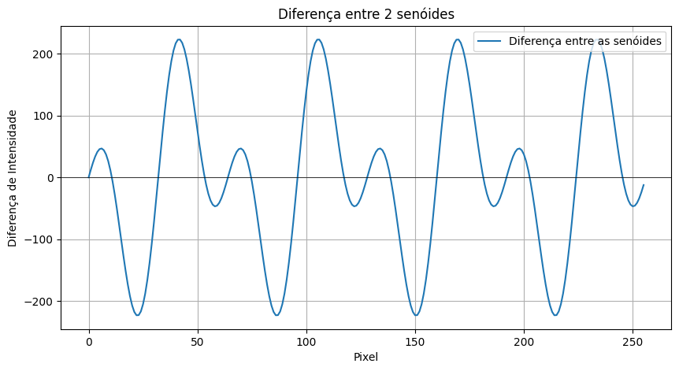

Nota-se que a sobreposição das ondas originais resulta em uma nova forma de onda periódica, porém mais complexa, devido à interferência entre elas.

=== Capítulo 10. Decomposição de imagens em planos de bits

Esta atividade explora a esteganografia, onde uma imagem é codificada discretamente dentro de outra. O código base utilizado foi https://github.com/IgorCirne/IgorCirnePDI/tree/main/exercicio_10/bitplanes.cpp[bitplanes.cpp], e o programa criado para recuperar a imagem oculta foi o https://github.com/IgorCirne/IgorCirnePDI/tree/main/exercicio_10/recover.cpp[recover.cpp].

Imagem de entrada:

.Figura 8: Imagem com informação oculta
[link=https://github.com/IgorCirne/IgorCirnePDI/tree/main/exercicio_10/esteganografia.png]
image::exercicio_10/esteganografia.png[]

Imagem recuperada:

.Figura 9: Resultado da decodificação
[link=https://github.com/IgorCirne/IgorCirnePDI/tree/main/exercicio_10/imagem_recuperada.png]
image::exercicio_10/imagem_recuperada.png[]

=== Capítulo 11. Rotulagem de regiões

O código https://github.com/IgorCirne/IgorCirnePDI/tree/main/exercicio_11/labeling.cpp[labeling.cpp] rotula regiões conectadas em uma imagem. No entanto, por utilizar o tipo `uchar` (8 bits), apenas 255 objetos distintos podem ser representados. Para permitir contagem além desse limite, é necessário alterar o tipo de `CV_8U` para `CV_16U`.

Modificação sugerida abaixo da linha 21:

[source,cpp]
----
21  labelImage = cv::Mat::zeros(height, width, CV_16U);
...
30  if (image.at<uchar>(i, j) == 255 && labelImage.at<ushort>(i, j) == 0) {
    // início do flood fill
...
42  std::cout << "A figura tem " << nobjects << " bolhas\n";
    cv::Mat displayImage;
    labelImage.convertTo(displayImage, CV_8U, 255.0 / nobjects);
----

Para a segunda parte do exercício, que envolve identificar bolhas com ou sem buracos internos (excluindo bordas), foi desenvolvido o código https://github.com/IgorCirne/IgorCirnePDI/tree/main/exercicio_11/newlabeling.cpp[newlabeling.cpp].

Evolução do processo:

.Figura 10: Imagem original
image::exercicio_11/bolhas.png[]

.Figura 11: Após remoção das bolhas da borda
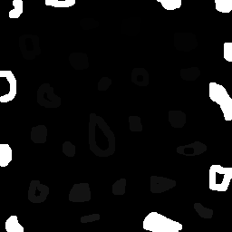

.Figura 12: Após rotulagem completa
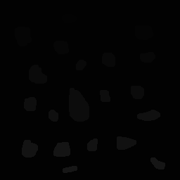

.Figura 13: Contagem final de bolhas
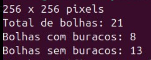

=== Capítulo 12. Equalização de histograma

Com base no código https://github.com/IgorCirne/IgorCirnePDI/tree/main/exercicio_12/histogram.cpp[histogram.cpp], foi desenvolvido o programa https://github.com/IgorCirne/IgorCirnePDI/tree/main/exercicio_12/equalize.cpp[equalize.cpp] para realizar a equalização do histograma de imagens capturadas com o aplicativo DroidCam.

Imagens de entrada e resultado:

.Figura 14: Dedo na câmera
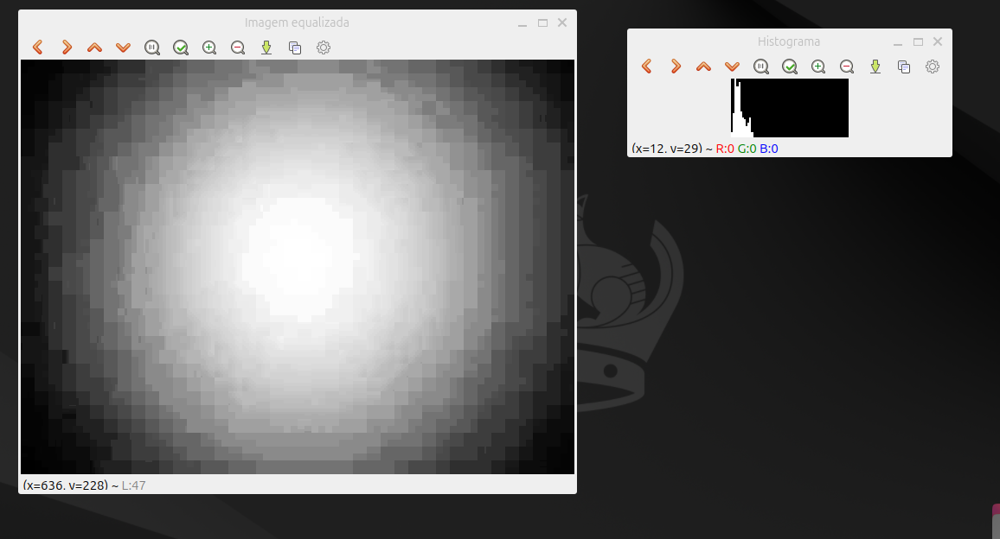

.Figura 15: Polvo rosa
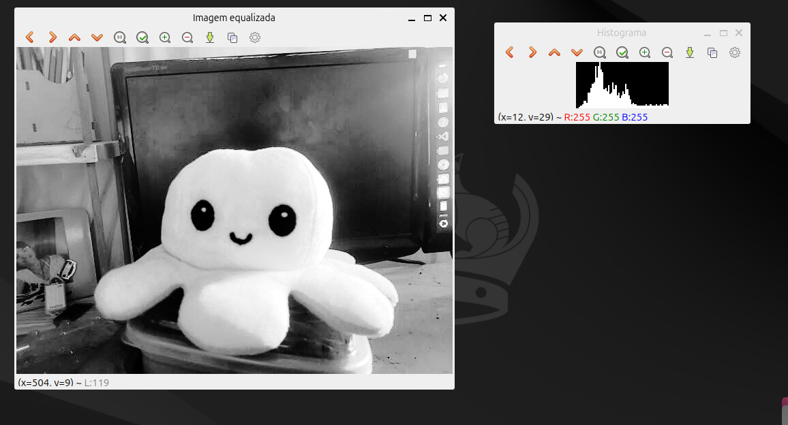

.Figura 16: Polvo verde
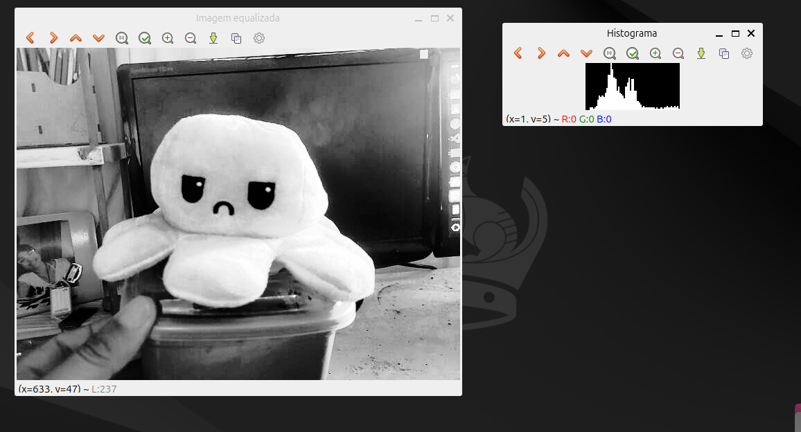

.Figura 17: Tentáculo rosa
image::exercicio_12/rosa.png[]

.Figura 18: Tentáculo verde
image::exercicio_12/verde.png[]

=== Capítulo 14. Filtragem no domínio espacial I – Convolução

O exercício propõe a aplicação de filtros de média com máscaras de diferentes tamanhos (3x3, 11x11 e 21x21). O código está disponível em: https://github.com/IgorCirne/IgorCirnePDI/tree/main/exercicio_14/convolucao.cpp[convolucao.cpp].

Resultados:

.Figura 19: Filtro 3x3
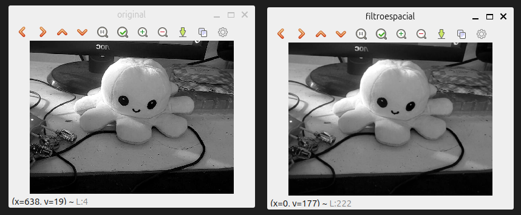

.Figura 20: Filtro 11x11
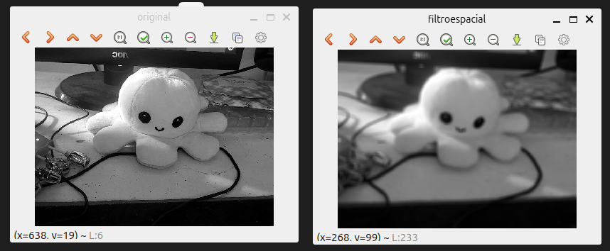

.Figura 21: Filtro 21x21
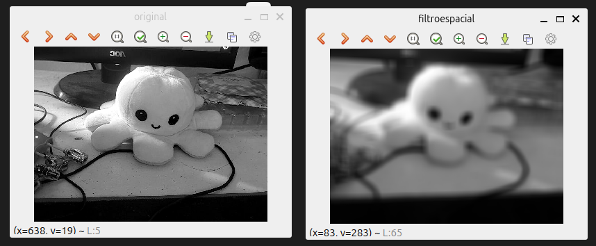

=== Capítulo 15. Filtragem no domínio espacial II – Tilt-Shift

*(Este capítulo ainda não possui conteúdo registrado.)*

== Lista 2

=== Capítulo 16. Transformada Discreta de Fourier

Com o código https://github.com/IgorCirne/IgorCirnePDI/tree/main/exercicio_16/dft.cpp[dft.cpp], foi calculado o espectro de magnitude de uma imagem senoidal. Em seguida, um código alternativo foi feito para ler a imagem diretamente de um arquivo `.yml`, disponível em: https://github.com/IgorCirne/IgorCirnePDI/tree/main/exercicio_16/dft_2.cpp[dft_2.cpp].

.Figura 22: Imagem de entrada
image::exercicio_16/Figura.png[]

.Figura 23: Espectro via imagem

.Figura 24: Espectro via YAML
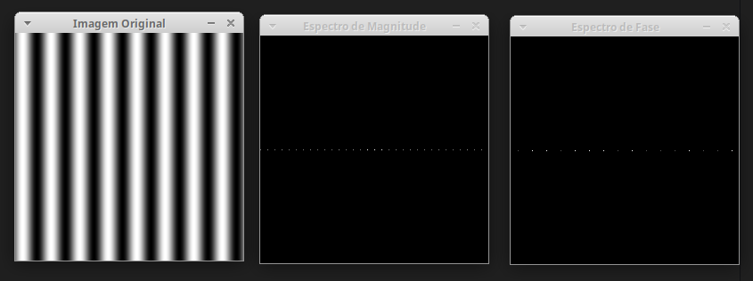

A segunda imagem apresenta melhor fidelidade à senóide original, pois os valores são lidos diretamente do arquivo de dados.

=== Capítulo 17. Filtragem no domínio da frequência – Filtro homomórfico

Foi proposto modificar o código https://github.com/IgorCirne/IgorCirnePDI/tree/main/exercicio_17/dftfilter.cpp[dftfilter.cpp] para aplicar correção de iluminação com filtro homomórfico. O código final está disponível em: https://github.com/IgorCirne/IgorCirnePDI/tree/main/exercicio_17/homomorfico.cpp[homomorfico.cpp].

Exemplos de resultado com ajustes na barra deslizante:

.Figura 25: Resultado automático
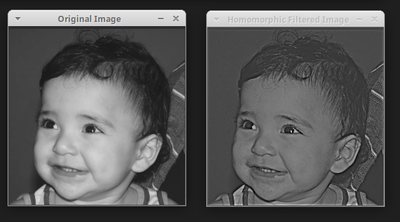

.Figura 26: Imagem original
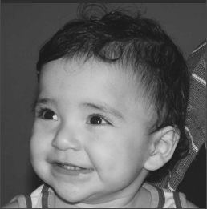

.Figura 27: Filtro com valor 14
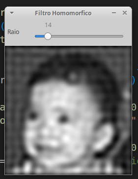

.Figura 28: Filtro com valor 50
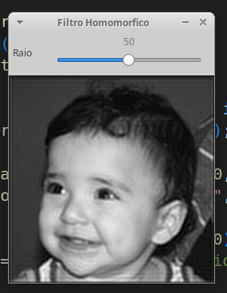

.Figura 29: Filtro com valor 100
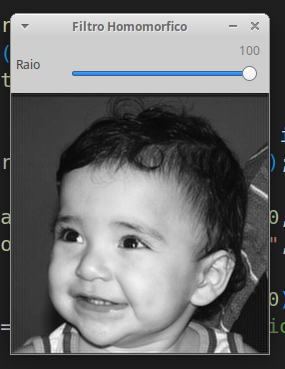

=== Capítulo 20. Quantização vetorial com k-means

A atividade consistia em realizar 10 execuções do algoritmo k-means com diferentes centros iniciais, baseado no código https://github.com/IgorCirne/IgorCirnePDI/tree/main/exercicio_20/kmeans.cpp[kmeans.cpp]. O código final com aleatoriedade está em: https://github.com/IgorCirne/IgorCirnePDI/tree/main/exercicio_20/kmeans_random.cpp[kmeans_random.cpp].

Resultados:

[cols="a,a,a", frame=none, grid=none, align=center]
|===
|image::exercicio_20/saida1.jpg[] 
+++Saída 1+++
|image::exercicio_20/saida2.jpg[] 
+++Saída 2+++
|image::exercicio_20/saida3.jpg[] 
+++Saída 3+++
|image::exercicio_20/saida4.jpg[] 
+++Saída 4+++
|image::exercicio_20/saida5.jpg[] 
+++Saída 5+++
|image::exercicio_20/saida6.jpg[] 
+++Saída 6+++
|image::exercicio_20/saida7.jpg[] 
+++Saída 7+++
|image::exercicio_20/saida8.jpg[] 
+++Saída 8+++
|image::exercicio_20/saida9.jpg[] 
+++Saída 9+++
|image::exercicio_20/saida10.jpg[] 
+++Saída 10+++
|===

== Lista 3

=== Capítulo 21. Extração de contornos

Este exercício foi dividido em duas partes. A primeira consistia em aplicar o código https://github.com/IgorCirne/IgorCirnePDI/blob/main/exercicio_21/contornos.cpp[contornos.cpp] à imagem dos retângulos e verificar o número de pontos extraídos do contorno.

Resultado da primeira execução:

.Figura 30: Contorno original com 746 pontos
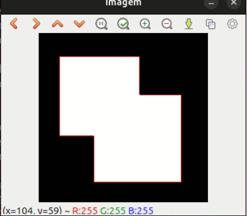

Na segunda parte, o programa foi modificado para reduzir os pontos de contorno, gerando o arquivo https://github.com/IgorCirne/IgorCirnePDI/blob/main/exercicio_21/contornos2.cpp[contornos2.cpp].

Resultado:

.Figura 31: Contorno simplificado com 10 pontos
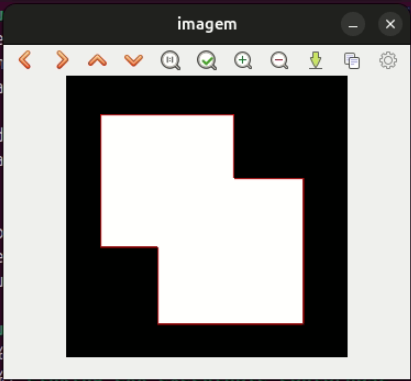

Nota: O resultado ideal seria 8 pontos, mas é possível que alguns cantos tenham sido contados duas vezes devido à interseção dos retângulos.

=== Capítulo 22. Extração de características – Momentos de Hu (regiões)

Neste exercício, o objetivo era identificar uma pessoa no meio de uma multidão utilizando momentos de Hu.

O código implementado está disponível em: https://github.com/IgorCirne/IgorCirnePDI/blob/main/exercicio_22/momentos-regioes-2.cpp[momento-regioes-2.cpp].

Imagens utilizadas:

.Figura 32: Pessoa isolada
image::exercicio_22/pessoa.jpg[]

.Figura 33: Imagem da multidão
image::exercicio_22/multidao.jpg[]

Resultado obtido após análise por varredura:

.Figura 34: Coordenada encontrada: [2129, 495]
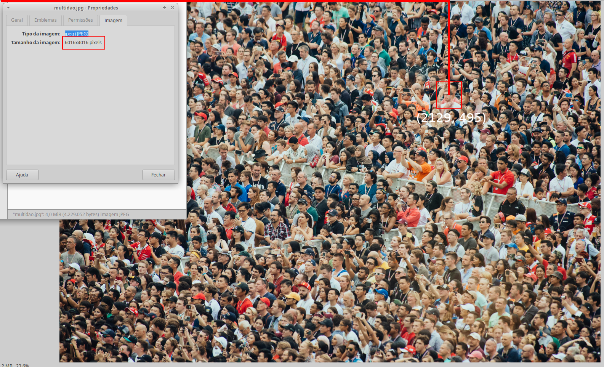

=== Capítulo 23. Extração de características – Momentos de Hu (contornos)

A proposta era modificar o código para extrair os momentos de Hu de contornos rotulados de uma imagem. O resultado foi implementado no arquivo https://github.com/IgorCirne/IgorCirnePDI/blob/main/exercicio_23/momentos.cpp[momentos.cpp].

Imagens envolvidas:

.Figura 35: Imagem original
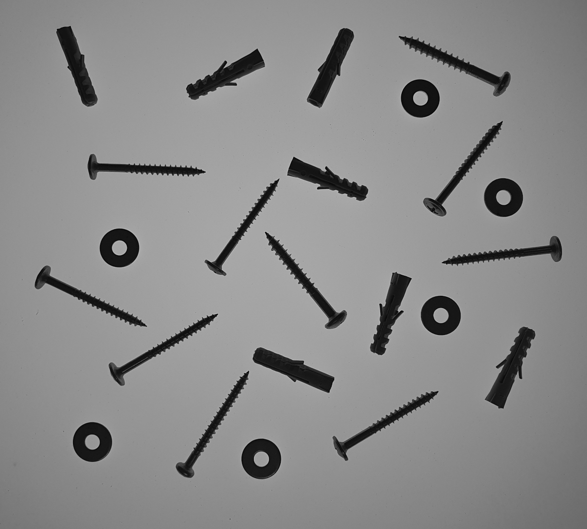

.Figura 36: Contornos rotulados
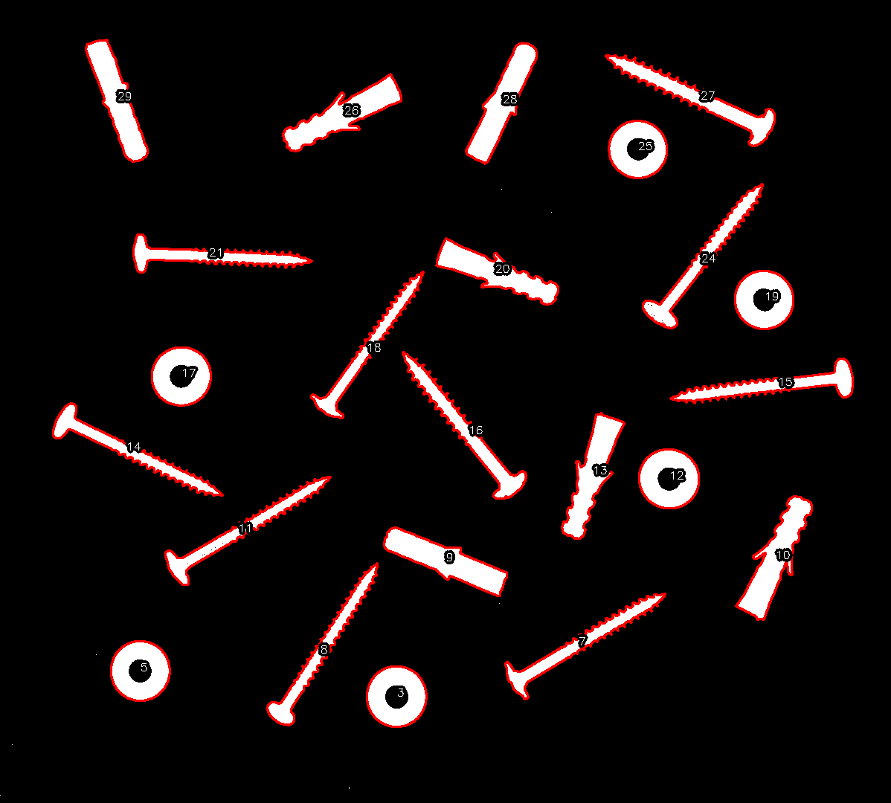

.Momentos de Hu para contornos identificados
|===
|N |𝜂~1~|𝜂~2~|𝜂~3~|𝜂~4~|𝜂~5~|𝜂~6~|𝜂~7~
|3| 0.798046| 5.00282| 8.66349| 12.1468| -22.5546| 14.9779| -23.5111
|5| 0.798076| 5.19683| 6.91077| 11.4442| -20.9916| -14.3809| -20.6653
|7| -0.0869539| -0.157887| 1.49555| 1.6833| 3.27273| 1.60454| -5.49111
|8| -0.120131| -0.228636| 1.25615| 1.35104| 2.65464| 1.23696| 4.88526
|9| 0.373823| 0.820174| 4.12233| 4.44221| 8.73046| 4.89129| 9.50767
|10| 0.371474| 0.82325| 3.12096| 3.355| 6.59299| 3.76676| -8.87464
|11| -0.129544| -0.243706| 1.00717| 1.13737| 2.20964| 1.01563| 4.50646
|12| 0.798008| 4.86567| 7.60833| 11.6456| -21.5786| -15.5273| -21.3335
|13| 0.334708| 0.736686| 2.78304| 2.96471| 5.83859| 3.33305| 8.44577
|14| -0.106722| -0.196061| 1.05617| 1.19955| 2.32742| 1.10162| -4.48549
|15| -0.0958813| -0.172621| 0.989909| 1.13171| 2.19255| 1.04588| 4.11805
|16| -0.032083| -0.0450323| 1.34178| 1.48339| 2.89599| 1.46109| -5.03442
|17| 0.798052| 5.09326| 7.97304| 13.5646| -24.3674| -16.275| 24.753
|18| -0.107708| -0.200982| 1.37277| 1.5268| 2.9766| 1.4266| -4.96253
|19| 0.798084| 5.30554| 6.73545| 11.1048| 20.1286| 13.9228| -20.2353
|20| 0.340446| 0.748341| 2.87315| 3.05754| 6.02289| 3.43174| -9.06747
|21| -0.11084| -0.204674| 1.06291| 1.20705| 2.34204| 1.10472| 5.49108
|24| -0.0581881| -0.095187| 1.47008| 1.70388| 3.29087| 1.65632| -5.51248
|25| 0.798063| 5.11058| 8.00379| 12.475| -23.804| 15.8112| -22.7158
|26| 0.369687| 0.816975| 3.27876| 3.50028| 6.89012| 3.91147| -8.30278
|27| -0.00117395| 0.019307| 1.50242| 1.67226| 3.2596| 1.68191| 6.34849
|28| 0.362363| 0.792965| 3.99692| 4.2232| 8.3335| 4.62146| 9.8081
|29| 0.338675| 0.738061| 3.85143| 4.03897| 7.98444| 4.4133| -9.42881
|===

Com esses dados, é possível notar que figuras semelhantes (como as arruelas circulares) compartilham valores de momentos semelhantes, ainda que pequenas variações possam surgir por rotação ou leve distorção.

=== Capítulo 24. Filtragem de forma com morfologia matemática

Neste exercício final, o objetivo era transformar dígitos de 7 segmentos em números legíveis por um sistema digital. É importante preservar o ponto decimal separadamente para manter a estrutura numérica.

Imagens de entrada:

[cols="a,a,a", frame=none, grid=none, align=center]
|===
|image::exercicio_24/digitos-1.png[] 
+++Dígito 1+++
|image::exercicio_24/digitos-2.png[] 
+++Dígito 2+++
|image::exercicio_24/digitos-3.png[] 
+++Dígito 3+++
|image::exercicio_24/digitos-4.png[] 
+++Dígito 4+++
|image::exercicio_24/digitos-5.png[] 
+++Dígito 5+++
|image::exercicio_24/digitos-6.png[] 
+++Dígito 6+++
|===

Após o processamento com o código https://github.com/IgorCirne/IgorCirnePDI/blob/main/exercicio_24/morfologia2.cpp[morfologia2.cpp], os resultados foram os seguintes:

[cols="a,a,a", frame=none, grid=none, align=center]
|===
|image::exercicio_24/digito-1-resultado.png[] 
+++Resultado 1+++
|image::exercicio_24/digito-2-resultado.png[] 
+++Resultado 2+++
|image::exercicio_24/digito-3-resultado.png[] 
+++Resultado 3+++
|image::exercicio_24/digito-4-resultado.png[] 
+++Resultado 4+++
|image::exercicio_24/digito-5-resultado.png[] 
+++Resultado 5+++
|image::exercicio_24/digito-6-resultado.png[] 
+++Resultado 6+++
|===

O resultado final foi satisfatório, com os números bem definidos para futura interpretação por um leitor automatizado.
