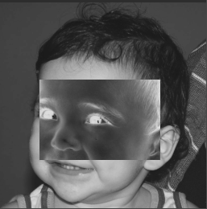
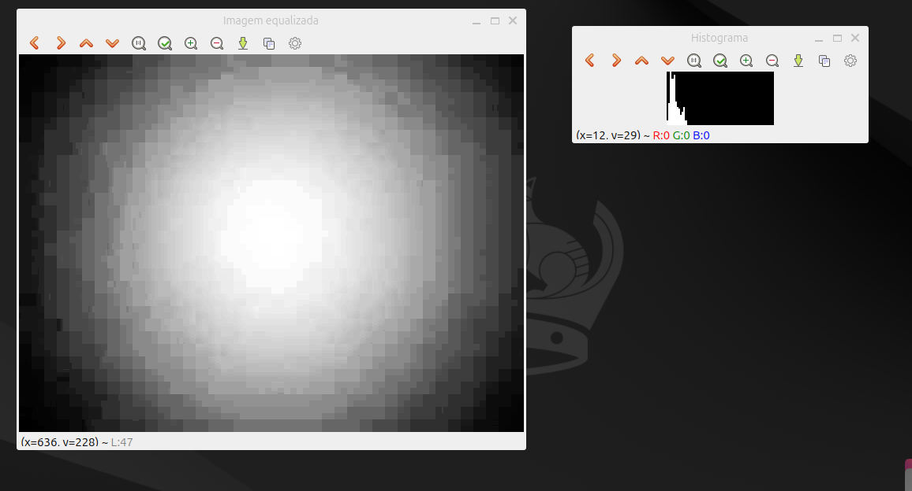
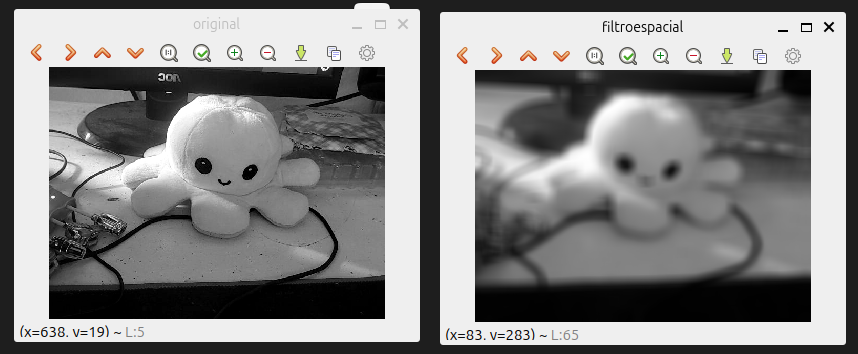
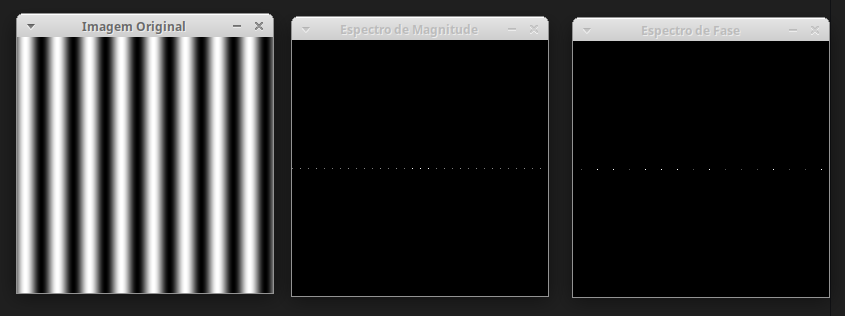
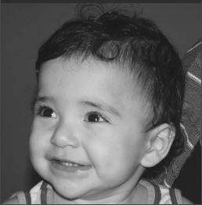
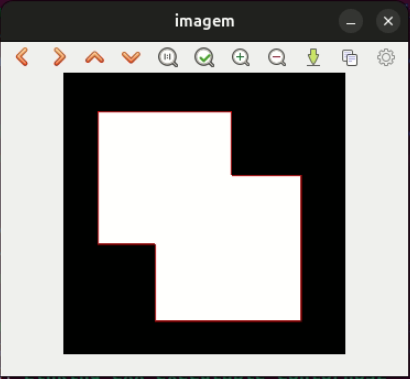
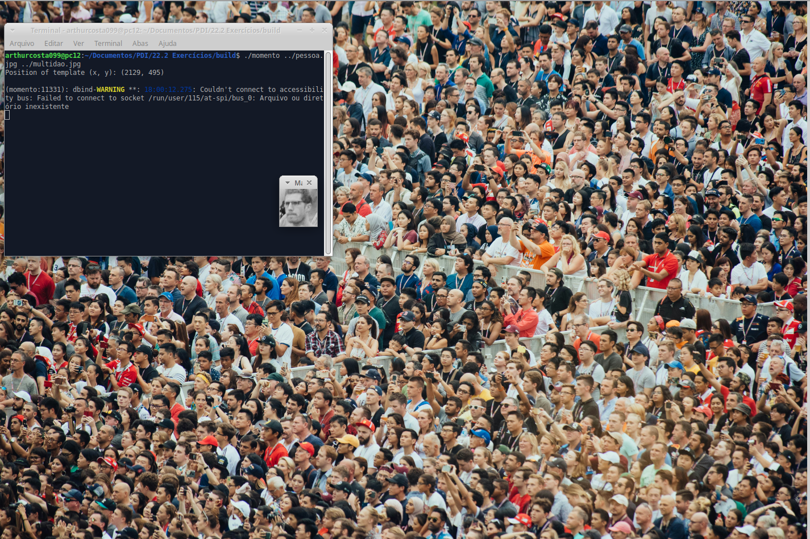
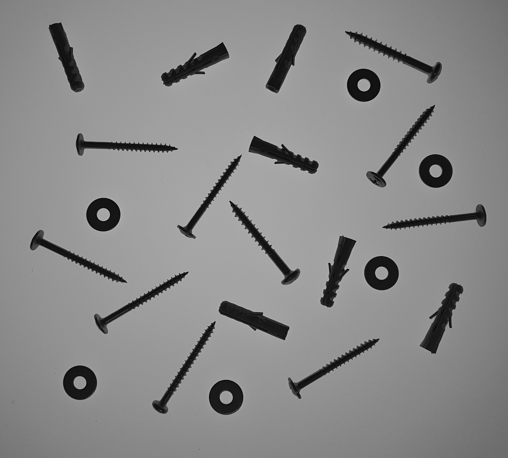

:toc: left
:toclevels: 2
:toc-title: Sumário
:!figure-caption:

= Processamento Digital de Imagens
Igor Cirne Borges de Oliveira

:icons: font
:summary:

toc::[]
== Introdução

Esta é uma página dedicada aos projetos e atividades de PDI, criada com AsciiDoc e hospedada no GitHub Pages.

== Lista 1

=== Capítulo 2. Manipulando pixels em uma imagem
Com base no programa https://github.com/IgorCirne/IgorCirnePDI/tree/main/exercicio_2/pixels.cpp[pixels.cpp] , foi gerado o programa https://github.com/IgorCirne/IgorCirnePDI/tree/main/exercicio_2/regions.cpp[regions.cpp] que é capaz de,
ao entrar com as coordenadas (x, y) de dois pontos P1 e P2, deixar a região entre eles com cores em negativo.

Para o exercício, a imagem abaixo foi dada como entrada no código:

.Figura 1: biel.png
[link=https://github.com/IgorCirne/IgorCirnePDI/tree/main/exercicio_2/biel.png]
image::exercicio_2/biel.png[]

E após compilar o programa com o https://github.com/IgorCirne/IgorCirnePDI/tree/main/exercicio_2/CMakeLists.txt[CMakeLists.txt] adequado, foram obtido os resultados abaixo:

P1 = [100, 50]
P2 = [200, 200]

.Figura 2: biel-2.png
[link=https://github.com/IgorCirne/IgorCirnePDI/tree/main/exercicio_2/biel-2.png]

P1 = [50, 50]
P2 = [100, 150]

.Figura 3: biel-3.png
[link=https://github.com/IgorCirne/IgorCirnePDI/tree/main/exercicio_2/biel-3.png]
image::exercicio_2/biel-3.png[]

Para a segunda parte do exercício, a de troca de regiões, foi feito o código de https://github.com/IgorCirne/IgorCirnePDI/tree/main/exercicio_2/trocaregioes.cpp[trocaregioes.cpp] e foi preciso modificar um pouco o arquivo anterior para este https://github.com/IgorCirne/IgorCirnePDI/tree/main/exercicio_2/CMakeLists2.txt[CMakeLists.txt], novamente, com a imagem original do Biel.png como entrada, resultando encontrado foi o da saída abaixo:

.Figura 4: trocaregioes.png
[link=https://github.com/IgorCirne/IgorCirnePDI/tree/main/exercicio_2/trocaregioes.png]
image::exercicio_2/trocaregioes.png[]

=== Capítulo 5, Serialização de dados em ponto flutuante via FileStorage

Nesse capítulo foi instruído na atividade à se fazer uma imagem de 256x256 pixels de uma senóide com 4 períodos e amplitude de 127, e gerar um .png e um .yml dessa senóide criada.

Senóide do exercício, com 8 períodos:

.Figura 5: Senóide de 8 períodos
[link=https://github.com/IgorCirne/IgorCirnePDI/tree/main/exercicio_5/8-senoide-256.png]
image::exercicio_5/8-senoide-256.png[]

Arquivo YML: https://github.com/IgorCirne/IgorCirnePDI/tree/main/exercicio_5/8-senoide-256.yml[8-senoide-256.yml]

O resultado gerado pelo programa para a senóide de 4 períodos foi a seguinte:

.Figura 6: Senóide de 4 períodos
[link=https://github.com/IgorCirne/IgorCirnePDI/tree/main/exercicio_5/4-senoide-256.png]
image::exercicio_5/4-senoide-256.png[]

Arquivo YML gerado: https://github.com/IgorCirne/IgorCirnePDI/tree/main/exercicio_5/4-senoide-256.yml[4-senoide-256.yml]

A outra parte do exercício pedia para traçar um gráfico da diferença calculada ao londo de uma linha extraída das imagens correspondentes.
O gráfico extraído foi esse:

.Figura 7: Diferença entre senóides
image::exercicio_5/diferenca.png[]

Pode-se notar na imagem que anova onda formada pela sobreposição das senóides das imagens anteriores também é periódica, mas com um padrão muito mais complexo do que as suas geradoras, isso acontece porque as ondas que a formaram se misturam e se interferem, o que acaba gerando essa nova estrutura oscilatória.

=== Capítulo 10, Decomposição de imagens em planos de bits

Essa atividade consiste em usar o código https://github.com/IgorCirne/IgorCirnePDI/tree/main/exercicio_10/bitplanes.cpp[bitplanes.cpp] como base e criar um que possa recuperar uma imagem codificada escondida dentro de outra, em um processo chamado de esteganografia.

Foi criado então o código https://github.com/IgorCirne/IgorCirnePDI/tree/main/exercicio_10/recover.cpp[recover.cpp] com esse intuito, e utilizado na imagem à seguir:

.Figura 8: Imagem codificada
[link=https://github.com/IgorCirne/IgorCirnePDI/tree/main/exercicio_10/esteganografia.png]
image::exercicio_10/esteganografia.png[]

O resultado que saiu após o código ser rodado foi a seguinte imagem:

.Figura 9: Imagem recuperada
[link=https://github.com/IgorCirne/IgorCirnePDI/tree/main/exercicio_10/imagem_recuperada.png]
image::exercicio_10/imagem_recuperada.png[]

=== Capítulo 11, Preenchendo regiões
Nessa situação do código de https://github.com/IgorCirne/IgorCirnePDI/tree/main/exercicio_11/labeling.cpp[labeling.cpp] somente 255 objetos poderem ser verificados, isso acontece por causa do tipo de dados (uchar) que é utilizado, pois como esse tipo possui 8 bits, o máximo de tons que se pode utilizar é de 2^8^, e caso seja necessário contar mais do que 255 objetos, o código iria acabar voltando ao tom 0, para que isso seja possível, é necessário uma mudança de tipo para um dado que tenha mais capacidade de armazenamento, como por exemplo, usar CV_16U que suporta 16bits, assim poderia contar até 2^16^ objetos na figura.

A alteração seria abaixo da linha 21 do programa https://github.com/IgorCirne/IgorCirnePDI/tree/main/exercicio_11/labeling.cpp[labeling.cpp], que é onde seria adicionado as linhas de código abaixo para se criar a iamgem com 16 bits para armazenar os rótulos, ao final, antes dos comandos de *imshow*, faz-se uma conversão de volta para 8 bits para poder normalizar a imagem e mostrá-la em tela novamente.

[source,cpp]
----
21
    *labelImage = cv::Mat::zeros(height, width, CV_16U);*
22    
    [. . .]
30  if (image.at<uchar>(i, j) == 255 *&& labelImage.at<ushort>(i, j) == 0*) {
31      // achou um objeto
32      nobjects++;
33      // para o floodfill as coordenadas
34      // x e y são trocadas.
35      p.x = j;
36      p.y = i;
37      // preenche o objeto com o contador
38      cv::floodFill(*labelImage*, p, nobjects);
    
    [. . .]
42  std::cout << "a figura tem " << nobjects << " bolhas\n";
    *cv::Mat displayImage;*
    *labelImage.convertTo(displayImage, CV_8U, 255.0 / nobjects);*
----

Entre "*" estão as partes adicionadas ao código de labeling.cpp para poder marcar mais de 255 objetos em cena.

Para a segunda parte do exercício, onde devemos aprimorar o código de https://github.com/IgorCirne/IgorCirnePDI/tree/main/exercicio_11/labeling.cpp[labeling.cpp] para que seja possível identificar regiões com ou sem buracos internos, foi feito o seguinte arquivo https://github.com/IgorCirne/IgorCirnePDI/tree/main/exercicio_11/newlabeling.cpp[newlabeling.cpp], onde foi assumido que não se deve contar as bolhas nas bordas da imagem.

Aqui abaixo podemos observar alguns passos do processo de FloodFill:  +
1. A imagem bolhas.png de entrada  +
2. Após excluir as bolhas que tocam as bordas do processo  +
3. Após finalizar o processo de labeling  +
4. A contagem do total de bolhas  +

.Figura 10: Bolhas
[link=https://github.com/IgorCirne/IgorCirnePDI/tree/main/exercicio_11/bolhas.png]
image::exercicio_11/bolhas.png[]

.Figura 11: Bolhas 2
[link=https://github.com/IgorCirne/IgorCirnePDI/tree/main/exercicio_11/bolhas2.png]
image::exercicio_11/bolhas2.png[]

.Figura 12: Bolhas 3
[link=https://github.com/IgorCirne/IgorCirnePDI/tree/main/exercicio_11/bolhas3.png]
image::exercicio_11/bolhas3.png[]

.Figura 13: Contagem de bolhas
[link=https://github.com/IgorCirne/IgorCirnePDI/tree/main/exercicio_11/status.png]
image::exercicio_11/status.png[]

=== Capítulo 12, Manipulação de histogramas

Para este exercício, foi proposto que fizéssemos um código tendo o https://github.com/IgorCirne/IgorCirnePDI/tree/main/exercicio_12/histogram.cpp[histogram.cpp] como base para equalizar o histograma de uma imagem gerada por uma câmera.
Nesse caso, foi utilizado o programa DroidCAM em conjunto com um celular Samsung M53 5G para conseguir obter os resultados em vídeo e capturas de tela do histograma, o código que foi utilizado é o https://github.com/IgorCirne/IgorCirnePDI/tree/main/exercicio_12/equalize.cpp[equalize.cpp], e os resultados obtidos foram as imagens a seguir:

.Figura 14: Dedo em frente à câmera
[link=https://github.com/IgorCirne/IgorCirnePDI/tree/main/exercicio_12/dedo .png]

.Figura 15: Polvo Rosa
[link=https://github.com/IgorCirne/IgorCirnePDI/tree/main/exercicio_12/polvo_rosa.png]
image::exercicio_12/polvo_rosa.png[]

.Figura 16: Polvo Verde
[link=https://github.com/IgorCirne/IgorCirnePDI/tree/main/exercicio_12/polvo_verde.png]
image::exercicio_12/polvo_verde.png[]

.Figura 17: Tentáculo rosa sobre a câmera
[link=https://github.com/IgorCirne/IgorCirnePDI/tree/main/exercicio_12/rosa.png]
image::exercicio_12/rosa.png[]

.Figura 18: Tentáculo verde sobre a câmera
[link=https://github.com/IgorCirne/IgorCirnePDI/tree/main/exercicio_12/verde.png]
image::exercicio_12/verde.png[]

=== Capítulo 14, Filtragem no domínio espacial I - Convolução

Neste exercício é proposto que seja feito filtros de média com tamanhos de máscaras de 11x11 e 21x21, faça uma captura de imagem e compare ambos os filtros com o filtro de média com máscara de tamanho 3x3.

O código utlilizado se encontra neste arquivo https://github.com/IgorCirne/IgorCirnePDI/tree/main/exercicio_14/convolucao.cpp[convolucao.cpp]

Após ser feito a captura com a mesma imagem, as saídas dos filtros fpra as seguintes:

.Figura 19: Saída de filtro com máscara tamanho 3x3
[link=https://github.com/IgorCirne/IgorCirnePDI/tree/main/exercicio_14/Filtro3x3.png]
image::exercicio_14/Filtro3x3.png[]

.Figura 20: Saída de filtro com máscara tamanho 11x11
[link=https://github.com/IgorCirne/IgorCirnePDI/tree/main/exercicio_14/Filtro11x11.png]
image::exercicio_14/Filtro11x11.png[]

.Figura 21: Saída de filtro com máscara tamanho 21x21
[link=https://github.com/IgorCirne/IgorCirnePDI/tree/main/exercicio_14/Filtro21x21.png]

=== Capítulo 15, Filtragem no domínio espacial II - TiltShift

== Lista 2

=== Capítulo 16, A Tranformada Discreta de Fourier

Para o exercício deste capítulo, é pedido que seja calculado o espectro de magnetude de uma imagem de senóide de 256x256 pixels usando o código do arquivo de https://github.com/IgorCirne/IgorCirnePDI/tree/main/exercicio_16/dft.cpp[dft.cpp] , e compará-lo com um código adaptado com base no https://github.com/IgorCirne/IgorCirnePDI/tree/main/exercicio_5/filestorage.cpp[filestorage.cpp] onde esse código terá como entrada um código em YAML equivalente à imagem de entrada do arquivo dft.cpp.

O código feito foi o https://github.com/IgorCirne/IgorCirnePDI/tree/main/exercicio_16/dft_2.cpp[dft_2.cpp] , onde a entrada foi a mesma imagem de 256x256 pixels, porém o arquivo ".yml" da mesma, gerado com o filestorage.cpp anteriormente.

.Figura 22: Imagem de entrada
[link=https://github.com/IgorCirne/IgorCirnePDI/tree/main/exercicio_16/figura.png]
image::exercicio_16/Figura.png[]

As saídas que consegui foram as seguintes:

.Figura 23: Saída direto da imagem
[link=https://github.com/IgorCirne/IgorCirnePDI/tree/main/exercicio_16/espectros.png]
image::exercicio_16/Espectros.png[]

.Figura 24: Saída do código YAML da imagem
[link=https://github.com/IgorCirne/IgorCirnePDI/tree/main/exercicio_16/espectros_2.png]

Pode não parecer nada diferente, mas a segunda imagem se aproxima mais da senóide original pelo fato de ela ser uma representação feita diretamente dos valores obtidos ao invés de serem obtidos após uma conversão para imagem como a primeira.

=== Capítulo 17. Filtragem no Domínio da Frequência

Nesse capítulo é proposto que peguemos o código da https://github.com/IgorCirne/IgorCirnePDI/tree/main/exercicio_17/dftfilter.cpp[dftfilter.cpp] e modifiquemos para poder corrigir iluminações em cenas com o filtro homomórfico.

Com as mudanças feitas, foi obtido o seguinte código https://github.com/IgorCirne/IgorCirnePDI/tree/main/exercicio_17/homomorfico.cpp[homomorfico.cpp] , onde, ao ser rodado com a imagem, mostrará uma barra para poder ajustar a iluminação da imagem como mostra no exemplo com as fotos do Biel à seguir.

.Figura 25: Filtro homomórfico automático antes de ser implementado o slider para ajustes manuais
[link=https://github.com/IgorCirne/IgorCirnePDI/tree/main/exercicio_17/homomorfico.png]
image::exercicio_17/homomorfico.png[]

.Figura 26: Imagem original
[link=https://github.com/IgorCirne/IgorCirnePDI/tree/main/exercicio_17/biel.png]

.Figura 27: Filtro com 14 selecionado na barra
[link=https://github.com/IgorCirne/IgorCirnePDI/tree/main/exercicio_17/Filtro-14.png]
image::exercicio_17/Filtro-14.png[]

.Figura 28: Filtro com 50 selecionado na barra
[link=https://github.com/IgorCirne/IgorCirnePDI/tree/main/exercicio_17/Filtro-50.png]
image::exercicio_17/Filtro-50.png[]

.Figura 29: Filtro com 100 selecionado na barra
[link=https://github.com/IgorCirne/IgorCirnePDI/tree/main/exercicio_17/Filtro-100.png]
image::exercicio_17/Filtro-100.png[]

=== Capítulo 20. Quantização vetorial com k-means

No capítulo em questão, a atividade a ser desenvolvida era a de usar o https://github.com/IgorCirne/IgorCirnePDI/tree/main/exercicio_20/kmeans.cpp[kmeans.cpp] como base para desenvolver um outro que execute com o parâmetro de nRodadas = 1, gerando 10 rodadas diferentes de algoritmos, e a cada rodada, gerando centros aleatórios para o algoritmo iniciar.
Foram realizadas as mudanças e o algoritmo final foi o https://github.com/IgorCirne/IgorCirnePDI/tree/main/exercicio_20/kmeans_random.cpp[kmeans_random.cpp] , e ao final das 10 rodadas com a imagem do https://github.com/IgorCirne/IgorCirnePDI/tree/main/exercicio_20/biel.png[Biel.png] , os resultados foram as seguintes saídas:

[cols="a,a,a", frame=none, grid=none, align=center]
|===
|image::exercicio_20/saida1.jpg[] 
+++Saída 1+++
|image::exercicio_20/saida2.jpg[] 
+++Saída 2+++
|image::exercicio_20/saida3.jpg[] 
+++Saída 3+++
|image::exercicio_20/saida4.jpg[] 
+++Saída 4+++
|image::exercicio_20/saida5.jpg[] 
+++Saída 5+++
|image::exercicio_20/saida6.jpg[] 
+++Saída 6+++
|image::exercicio_20/saida7.jpg[] 
+++Saída 7+++
|image::exercicio_20/saida8.jpg[] 
+++Saída 8+++
|image::exercicio_20/saida9.jpg[] 
+++Saída 9+++
|image::exercicio_20/saida10.jpg[] 
+++Saída 10+++
|
|
|===

As saídas estão diferentes exatamente por causa dos centros escolhidos aleatoriamente no início.

== Lista 3

=== Capítulo 21. Extração de contornos

Neste capítulo, o exercício é dividido em 2 partes, a primeira pede para aplicar o código original do https://github.com/IgorCirne/IgorCirne.github.io/blob/main/exercicio_21/contornos.cpp[contornos.cpp] na imagem dos retângulos e ver quantos pontos são gerados para o seu contorno.

O resultado foi o seguinte:

.Figura 30: Pontos de contorno extraídos
[link=https://github.com/IgorCirne/IgorCirne.github.io/blob/main/exercicio_21/contornos_original.png]
image::exercicio_21/contornos_original.png[]

Após isso, a atividade pediu para modificar o programa e extrair os contornos novamente, ao final o código finalizado ficou neste arquivo https://github.com/IgorCirne/IgorCirne.github.io/blob/main/exercicio_21/contornos2.cpp[contornos2.cpp] e a saída foi a seguinte:

.Figura 31: Pontos de contorno simplificados extraídos
[link=https://github.com/IgorCirne/IgorCirne.github.io/blob/main/exercicio_21/cont_retangulos.png]

Como podemos notar, o número de pontos encontrados caiu de 746 para 10, ou seja, as modificações pedidas no código fizeram que pontos redundantes fossem ignorados na hora de contar os pontos do contorno.

OBS: O resultado IDEAL seriam 8 pontos, mas é possível que tenham sido contados 2 pontos em cada aresta interna, pois é onde ficam as interseções dos quadrados.

=== Capítulo 22. Extração de características: Momentos de Hu para regiões

Esse exercício foi um pouco complicado de se resolver, pois ele pedia para procurar por uma pessoa no meio da multidão, o código feito para isso foi o 

https://github.com/IgorCirne/IgorCirne.github.io/blob/main/exercicio_22/momentos-regioes-2.cpp[momento-regioes-2.cpp] , que rodou com as seguintes imagens para procurar.

.Figura 32: Pessoa.jpg
[link=https://github.com/IgorCirne/IgorCirne.github.io/blob/main/exercicio_22/pessoa.jpg]
image::exercicio_22/pessoa.jpg[]

.Figura 33: Multidao.jpg
[link=https://github.com/IgorCirne/IgorCirne.github.io/blob/main/exercicio_22/multidao.jpg]
image::exercicio_22/multidao.jpg[]

O resultado depois de fazer a varredura foi o seguinte:

.Figura 34: Resultado.png
[link=https://github.com/IgorCirne/IgorCirne.github.io/blob/main/exercicio_22/resultado.png]

.Figura 35: Localização.png
[link=https://github.com/IgorCirne/IgorCirne.github.io/blob/main/exercicio_22/localizacao.png]
image::exercicio_22/localizacao.png[]

Como pode ser notado nessa última imagem, o resultado foi que o algoritmo encontrou a pessoa procurada no ponto [2129, 495] no meio da multidão.

=== Capítulo 23. Extração de características: Momentos de Hu para contornos 

Agora nesse capítulo, foi pedido para modificar o código, o que gerou o arquivo https://github.com/IgorCirne/IgorCirne.github.io/blob/main/exercicio_23/momentos.cpp[momentos.cpp] após as alterações, e com essas mudanças, foi pedido para se obter um arquivo com números, que eles, por sua vez, são valores equivalentes aos momentos de Hu para os contornos de figuras que estão disponíveis na imagem que foi processada pelo código.

.Figura 36: Imagem original.png
[link=https://github.com/IgorCirne/IgorCirne.github.io/blob/main/exercicio_23/momentos.png]

.Figura 37: Imagem processada.png
[link=https://github.com/IgorCirne/IgorCirne.github.io/blob/main/exercicio_23/contornos-rotulados.png]
image::exercicio_23/contornos-rotulados.png[]

.Momentos de Hu dos contornos das figuras
|===
|N| 𝜂~1~| 𝜂~2~| 𝜂~3~| 𝜂~4~| 𝜂~5~| 𝜂~6~| 𝜂~7~
|3| 0.798046| 5.00282| 8.66349| 12.1468| -22.5546| 14.9779| -23.5111
|5| 0.798076| 5.19683| 6.91077| 11.4442| -20.9916| -14.3809| -20.6653
|7| -0.0869539| -0.157887| 1.49555| 1.6833| 3.27273| 1.60454| -5.49111
|8| -0.120131| -0.228636| 1.25615| 1.35104| 2.65464| 1.23696| 4.88526
|9| 0.373823| 0.820174| 4.12233| 4.44221| 8.73046| 4.89129| 9.50767
|10| 0.371474| 0.82325| 3.12096| 3.355| 6.59299| 3.76676| -8.87464
|11| -0.129544| -0.243706| 1.00717| 1.13737| 2.20964| 1.01563| 4.50646
|12| 0.798008| 4.86567| 7.60833| 11.6456| -21.5786| -15.5273| -21.3335
|13| 0.334708| 0.736686| 2.78304| 2.96471| 5.83859| 3.33305| 8.44577
|14| -0.106722| -0.196061| 1.05617| 1.19955| 2.32742| 1.10162| -4.48549
|15| -0.0958813| -0.172621| 0.989909| 1.13171| 2.19255| 1.04588| 4.11805
|16| -0.032083| -0.0450323| 1.34178| 1.48339| 2.89599| 1.46109| -5.03442
|17| 0.798052| 5.09326| 7.97304| 13.5646| -24.3674| -16.275| 24.753
|18| -0.107708| -0.200982| 1.37277| 1.5268| 2.9766| 1.4266| -4.96253
|19| 0.798084| 5.30554| 6.73545| 11.1048| 20.1286| 13.9228| -20.2353
|20| 0.340446| 0.748341| 2.87315| 3.05754| 6.02289| 3.43174| -9.06747
|21| -0.11084| -0.204674| 1.06291| 1.20705| 2.34204| 1.10472| 5.49108
|24| -0.0581881| -0.095187| 1.47008| 1.70388| 3.29087| 1.65632| -5.51248
|25| 0.798063| 5.11058| 8.00379| 12.475| -23.804| 15.8112| -22.7158
|26| 0.369687| 0.816975| 3.27876| 3.50028| 6.89012| 3.91147| -8.30278
|27| -0.00117395| 0.019307| 1.50242| 1.67226| 3.2596| 1.68191| 6.34849
|28| 0.362363| 0.792965| 3.99692| 4.2232| 8.3335| 4.62146| 9.8081
|29| 0.338675| 0.738061| 3.85143| 4.03897| 7.98444| 4.4133| -9.42881
|===

Com esses valores encontrados pelos momentos de Hu, podemos observar que figuras semelhantes vão ter valores semelhantes, como por exemplo, as figuras de número 3, 5 e 12 (entre outras), que são arruelas circulares, e claro que, mesmo que sejam semelhantes, se forem contornos parecidos, mas que estão rotacionados, podem haver divergências, como no caso do momento 𝜂~7~ das figuras 10 e 13, que estão basicamente apontando para sentidos opostos.

=== Capítulo 24. Filtragem de forma com morfologia matemática

Nesse último exercício foi pedido para que se possa fazer os dígitos de 7 segmentos virarem um número que possa ser processado por um leitor digital, e para isso, é necessário juntar os 7 segmentos e, por poder ser um número decimal, devemos manter o ponto que separa a parte inteira da parte fracionada separado.
As imagens com números de entradas foram as seguintes:

[cols="a,a,a", frame=none, grid=none, align=center]
|===
|image::exercicio_24/digitos-1.png[] 
+++Dígito 1+++
|image::exercicio_24/digitos-2.png[] 
+++Dígito 2+++
|image::exercicio_24/digitos-3.png[] 
+++Dígito 3+++
|image::exercicio_24/digitos-4.png[] 
+++Dígito 4+++
|image::exercicio_24/digitos-5.png[] 
+++Dígito 5+++
|image::exercicio_24/digitos-6.png[] 
+++Dígito 6+++
|===

Após passarem pelo código https://github.com/IgorCirne/IgorCirne.github.io/blob/main/exercicio_24/morfologia2.cpp[morfologia2.cpp] , as saídas foram o seguinte:

[cols="a,a,a", frame=none, grid=none, align=center]
|===
|image::exercicio_24/digito-1-resultado.png[] 
+++Dígito 1+++
|image::exercicio_24/digito-2-resultado.png[] 
+++Dígito 2+++
|image::exercicio_24/digito-3-resultado.png[] 
+++Dígito 3+++
|image::exercicio_24/digito-4-resultado.png[] 
+++Dígito 4+++
|image::exercicio_24/digito-5-resultado.png[] 
+++Dígito 5+++
|image::exercicio_24/digito-6-resultado.png[] 
+++Dígito 6+++
|===

O que foi uma saída aceitável para o leitor poder decifrar qual número está sendo mostrado no leitor de 7 dígitos.
